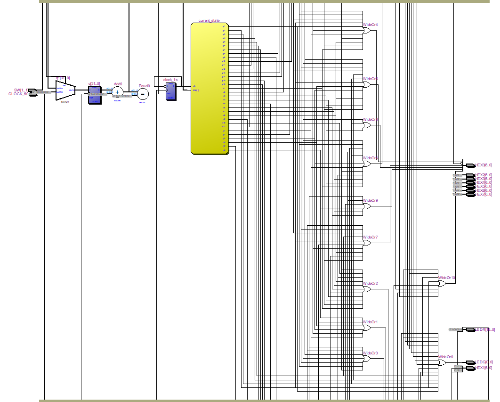

# Traffic Light Controller on DE2 Cyclone II FPGA

This Verilog project simulates a traffic light system using a Finite State Machine (FSM) on the DE2 board with the Cyclone II FPGA.

## 🎯 Features
- LEDG/LEDR used for traffic light colors: Green, Yellow, Red
- 7-segment display (HEX0, HEX1) used as a countdown timer
- Reset switch (SW[1]) to restart the sequence
- 1-second internal clock generated from `CLOCK_50` (50 MHz)

## 🔧 Tools Used
- Quartus II 13.0 (for Cyclone II - EP2C35F672C6)
- DE2 Development Board
- Verilog HDL

## 📂 File Structure
- `bai10.v`: Main Verilog file implementing FSM for traffic light
- `doc/schematic.png`: System block diagram or FSM visualization

## ⏱️ FSM States
- 🟢 Green: 16 → 1
- 🟡 Yellow: 6 → 1
- 🔴 Red: 11 → 1

## 📷 Screenshots

## 👨‍💻 Author
LE MINH TRI - 3rd Year Computer Engineering Student  - https://github.com/minhtrile2004
MSSV: 22680551

## 📜 License
MIT License
